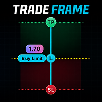
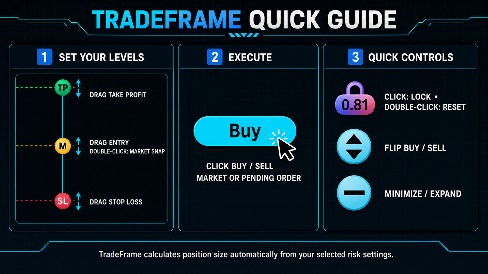

  

# TradeFrame Demo: Free MT4 & MT5 Position Sizer and Trade Execution Utility

TradeFrame Demo is a free MetaTrader position sizer, lot-size calculator, risk
management and manual trade-execution utility for MT4 and MT5 demo accounts.

It places draggable Entry, Stop Loss, and Take Profit controls directly on the
chart and calculates volume from the selected risk settings.

**Official website:** [KamalQuant Product Hub](https://kamalquant.github.io/#tradeframe)

## Download

- [Download TradeFrame Demo for MT5](https://github.com/KamalQuant/TradeFrame-Demo/releases/latest/download/TradeFrame-Demo-MT5-v1.00.zip)
- [Download TradeFrame Demo for MT4](https://github.com/KamalQuant/TradeFrame-Demo/releases/latest/download/TradeFrame-Demo-MT4-v1.00.zip)
- [View the latest release](https://github.com/KamalQuant/TradeFrame-Demo/releases/latest)

## Important

TradeFrame Demo works on **demo accounts only**. It does not generate trading
signals or choose entries automatically. You remain responsible for every order
you place.

## Main features

- Draggable Entry, Stop Loss, and Take Profit levels
- Automatic position-size calculation
- Equity percentage, balance percentage, fixed-money, and fixed-lot modes
- Market, Limit, and Stop order execution
- Real-time risk, reward, and R:R display
- Buy/Sell direction switching
- Market-price snap mode
- Configurable hotkeys
- Optional chart risk/reward fill
- Embedded interface images and sounds

## Quick guide

## Installation

### MetaTrader 5

1. Download and extract `TradeFrame-Demo-MT5-v1.00.zip`.
2. In MT5, select **File > Open Data Folder**.
3. Open `MQL5\Experts`.
4. Copy `TradeFrame Demo.ex5` into that folder.
5. Restart MT5 or refresh Expert Advisors in Navigator.
6. Attach TradeFrame Demo to a chart and enable Algo Trading.

### MetaTrader 4

1. Download and extract `TradeFrame-Demo-MT4-v1.00.zip`.
2. In MT4, select **File > Open Data Folder**.
3. Open `MQL4\Experts`.
4. Copy `TradeFrame Demo.ex4` into that folder.
5. Restart MT4 or refresh Expert Advisors in Navigator.
6. Attach TradeFrame Demo to a chart and enable AutoTrading.

## File integrity

SHA-256 hashes are published in [CHECKSUMS.txt](CHECKSUMS.txt). Compare the hash
after downloading if you want to verify that the file is unchanged.

## Distribution

The original, unmodified Demo package may be shared freely. Selling, modifying,
decompiling, repackaging, or misrepresenting the software is prohibited. See
[LICENSE.md](LICENSE.md) for the complete distribution terms.

## Support and customization

[Contact KamalQuant on WhatsApp](https://wa.me/923708757882) for installation, licensing, or product support. Custom configurations may be available on request; requirements and pricing are agreed separately.

## Risk notice

Trading involves substantial risk. TradeFrame is an execution and
risk-calculation utility, not financial advice or a profit-guaranteeing system.
Always verify order direction, volume, Entry, Stop Loss, and Take Profit before
execution.
